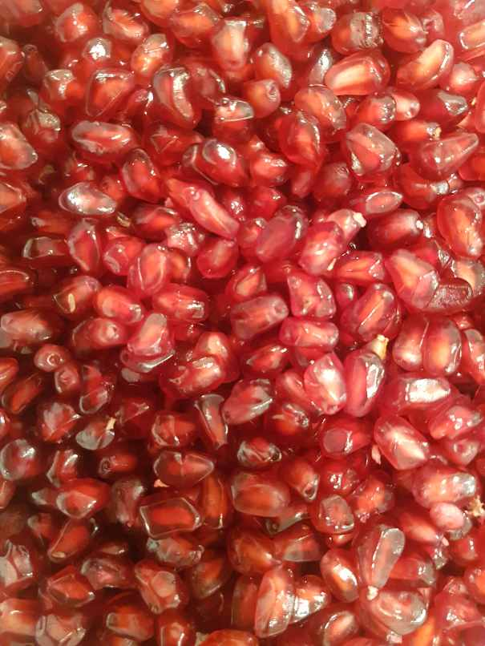

# -Texture-Synthesis

Texture Synthesis is the process of algorithmically constructing a large digital image from a small digital sample image by taking advantage of its structural content. It is an object of research in computer graphics and is used in many fields, amongst others digital image editing, 3D computer graphics and post-production of films.

# Given Image

  

# Results

  
  
  
  

